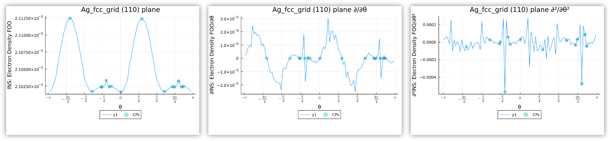
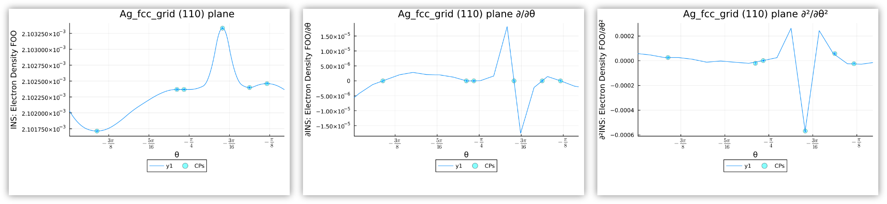

# DGB-condensed CP analysis
##### Feb 3, 2023
##### By Tim Wilson

This tool finds critical points of differential gradient bundle (DGB) condensed functions, which are two-dimensional, periodic functions mapped onto the elements of a triangulated sphere mesh.

## The hard way, using sphere-slice intersection data

Eventually, this process will be more straightforward.
In the meantime, it involves specifying one or more slices (planes) in Tecplot 360 EX, extracting the intersection of those slices with the gradient bundle analysis (GBA) sphere, and exporting that data as a `.dat` file to be used with the present tool.
The process is as follows:

### 1. Prepare input sphere-slice data 

1. Perform a complete run of GBA, resulting in a Tecplot 360 file (*i.e.* `Ag.lpk`) with a number of zones, including one or more sphere zones produced by GBA.
  * **Before proceeding, we need to ensure that the first zone in the `Zone Style` dialog is a GBA sphere zone. This is done by "moving" the other zones**
    1. Use `Data—>Create Zone—>Duplicate...` to duplicate zones 1 through right before the first GBA sphere zone, then
    2. Use `Data—>Delete—>Zone...` to delete zones 1 through right before the first GBA sphere zone.
    * (This is because the extracted sphere-slice intersection zones we will be creating will inherit their variable data types from the first zone in the list. The variables we're interested—DGB-condensed properties—are set to bit-type for all non-sphere zones, so that if a non-sphere zone is the first zone, the resulting intersection will try to store the condensed properties as bit type.)
1. Define the desired sphere-slice intersections in Tecplot 360 EX (macOS or Windows) in the `Definition` tab of the `Slice Details` dialog.
  * Select to slice through `Surface Zones`
  * Tecplot 360 EX lets you specify arbitrary slices in a couple of ways
  * You can move a plane normal to the XYZ (or IJK) directions, or if you
  * Select `Arbitrary` slice location, you can then
    * Specify a rotation origin and 
      * rotate in controlled steps about the XYZ axes or
      * also specify a normal vector for the plane, or
    * Click the `3 points...` button to define a plane by three XYZ points
      * The way this is used is with the button *next* to the `3 points...` button , which changes the mouse mode to a selection tool that lets you *click* at any point on a surface or *ctrl-click* (*command-click* on macOS) to select a scatter point such as a critical point in the charge density.
      * This enables you to deactivate the sphere zone and define a plane based on the nuclear CP at the sphere's origin and two other connected bond/ring/cage CPs. Once the slice is defined, you can reactivate the sphere zone and extract the intersection.
1. Extract sphere-slice intersections.
  1. Once you have a slice defined for a particular sphere-slice intersection, and the sphere zone to be intersected is the only zone active, and the first zone in the list of zones is a sphere zone, then you should be able to see the sphere-slice intersection that will be extracted. Then, you can
  2. Use `Data—>Extract—>Slices...`, selecting `All active slice groups`, a connected zone for each `slice`, and save to `I-ordered if possible`.
  3. Use the `Data—>Data Set Info` dialog to rename the newly created slice. **All slices in a given system must have a unique name.**
2. Repeat steps 1 and 2 for each slice you need to extract sufficient to capture all CPs on the sphere. *Note that coincident CPs, that is, CPs coincident with two or more sphere-slice intersections, will appear in a separate output CSV file for convenience. For that reason, it intended for you to "target" each CP of interest by extracting a pair of slices that cross the CP, such as in figure 1 below.* 

***Figure 1.** DGB-condensed kinetic energy density in FCC Ag with three sphere-slice intersections shown and labeled.* 

### 2. Perform analysis

1. After having [installed the Julia Programming Language](https://julialang.org/downloads/), open a Julia terminal ([REPL](https://docs.julialang.org/en/v1/stdlib/REPL/)):
   * (For the purposes of using this tool, it is sufficient to use Julia from command line, but I recommend getting [Visual Studio Code](https://code.visualstudio.com/download) with the [Julia extension](https://code.visualstudio.com/docs/languages/julia) which provides the ability to work with Julia from terminal, scripts, or Jupyter notebooks with built-in plotting, debugging, and profiling capabilities)
 2. Navigate to where you extracted the contents of this package archive `cd("/path/to/Condensed_CP_Analysis")`
 3. Now activate the `Condensed_CP_Analysis` "package" by first entering the Julia `Pkg` environment by pressing `]` (right bracket), and then entering `activate .`
 4. Exit the `Pkg` environment by pressing backspace.
 5. Now run the analysis on the included example data with `sys = Condensed_CP_Analysis.sphere_slice_analysis("/path/to/Condensed_CP_Analysis/data/AgSphereSlices.dat", spacing=π/50)`

### 3. Results

1. After running the command in 2.5, you'll find output files in `/path/to/Condensed_CP_Analysis/data/out` including two `.csv` files and many plots in `.pdf` format.
* One set of plots, one per DGB-condensed variable, showing all critical points over (almost) the full range [-π,π]
* Matching sets showing the first and second derivatives.

***Figure 2.** Output plots with full 2π range.*

* Additional plots of that same data, but zoomed in at CP locations to better show function character

***Figure 2.** Output plots with full 2π range.*

* One `.csv` file containing only "matched" CPs that coincide with two or more sphere-slice intersections
  * In this file, "**# matched**" is a critical point identifier for the matched critical points, whereas "**#**" is the critical point identifier that corresponds to those in the plots. When two adjacent rows share the same value of "**# matched**", it means they also share the same approximate xyz values, and the Euclidean distance between the matched points is given in the "**distance**" column.

***Table 1.** Example of output tabulated data for "matched" CPs*
| # | # matched | d²f/d𝜽² | df/d𝜽 | distance | f(xyz)    | plane       | 𝜽 | variable     | x    | y    | z    |
|---|-----------|-------------|-----------|----------|-----------|-------------|-------|--------------|------|------|------|
| 7 | 1         | -2.6E-05    | 0         | 0.019    | 0.2840972 | (100) plane | 2.24  | INS: tau FOO | 0.0  | 0.0  | -2.1 |
| 1 | 1         | -7.9E-05    | 0         | 0.019    | 0.2840972 | (010) plane | -2.46 | INS: tau FOO | 0.0  | 0.0  | -2.1 |
| 1 | 3         | -2.3E-04    | 0         | 0.005    | 0.2840980 | (100) plane | -2.48 | INS: tau FOO | 0.0  | -2.1 | 0.0  |
| 1 | 3         | -1.9E-04    | 0         | 0.005    | 0.2840980 | (110) plane | -2.20 | INS: tau FOO | 0.0  | -2.1 | 0.0  |
| 8 | 5         | 2.6E-04     | 0         | 0.007    | 0.2840786 | (010) plane | 2.96  | INS: tau FOO | -1.5 | 0.0  | -1.5 |
| 7 | 5         | -1.4E-04    | 0         | 0.007    | 0.2840787 | (110) plane | 2.52  | INS: tau FOO | -1.5 | 0.0  | -1.5 |

* Another `.csv` file containing all CPs for all variables for all sphere-slice intersections. This files is only included for completeness, and is only useful for a) getting more accurate values by averaging values for degenerate CPs, or b) checking values of "matched" CPs against others.

## The easy way

...coming soon™️